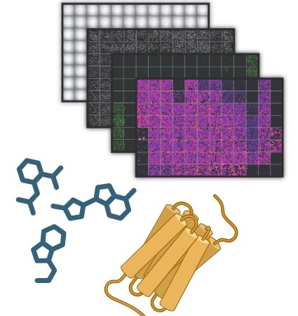
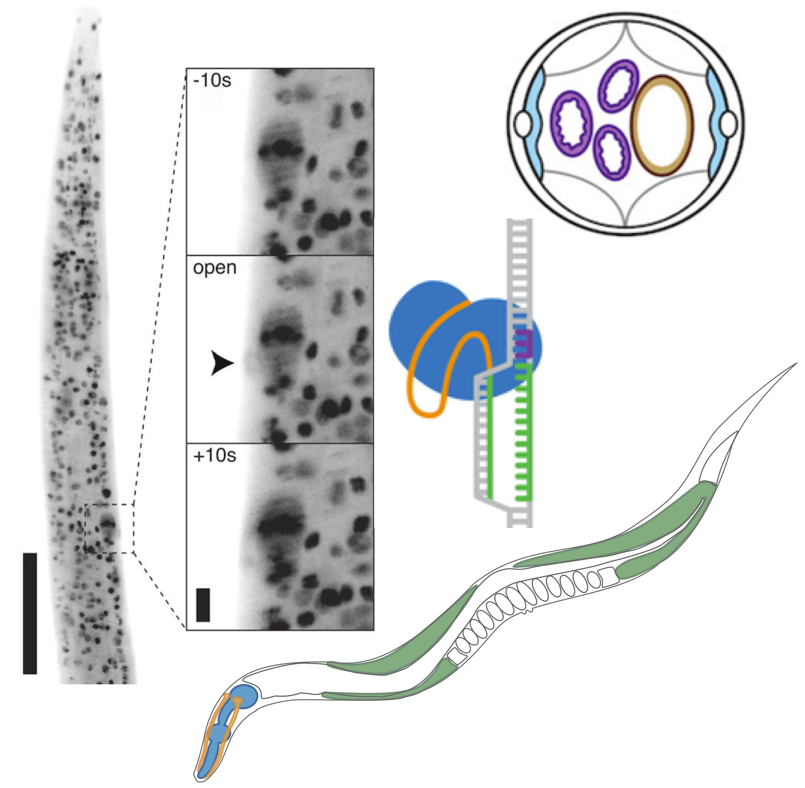
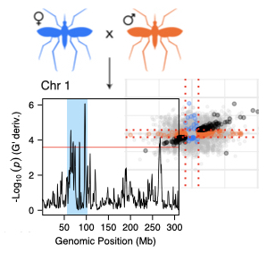
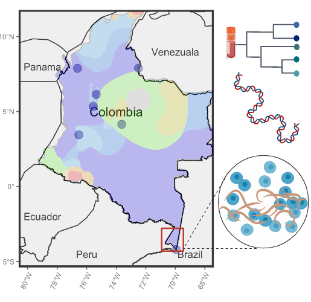
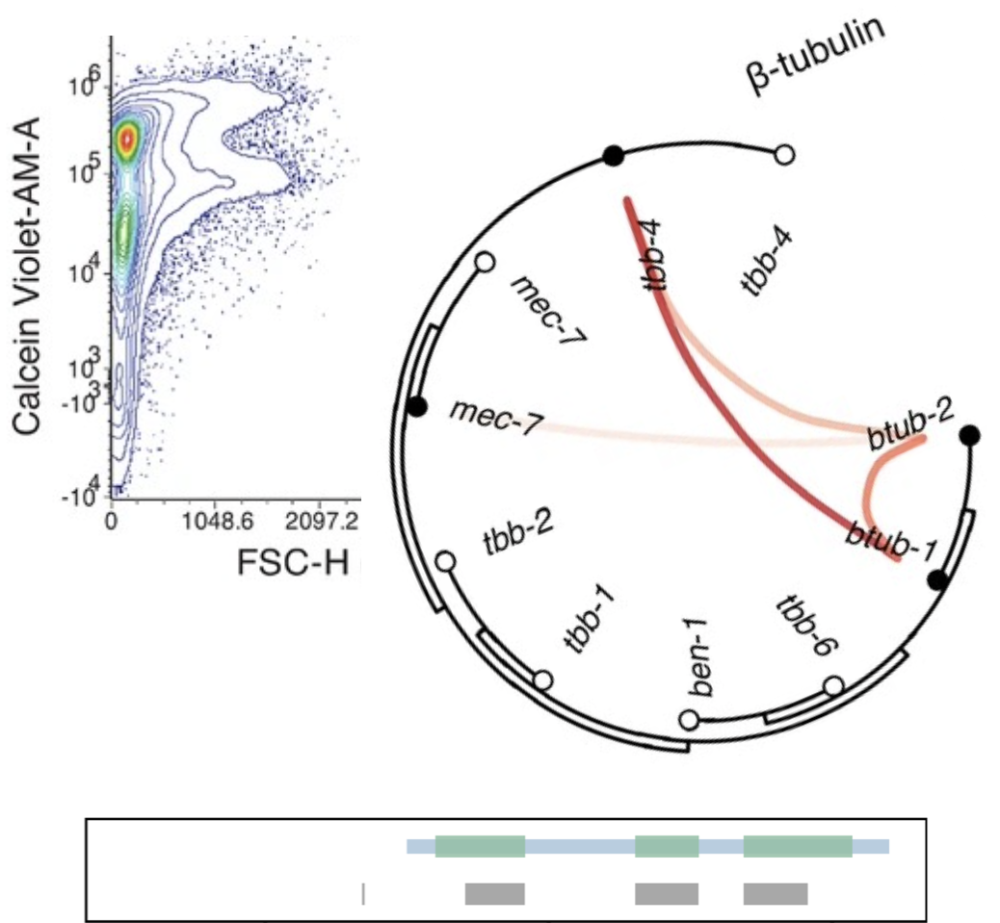

[Neglected Diseases (NTDs)](http://www.who.int/neglected_diseases/diseases/en/) caused by parasitic worms (helminths) infect over one billion humans and impose a debilitating health and economic burden throughout the world. Parasitic diseases are also a major threat to animal and plant health. The central ambition of our lab is to combine molecular, genetics, and pharmacalogical approaches to make discoveries that improve our understanding of parasite biology and host-parasite interactions, as well as our ability to treat human and animal parasitic infections. Summaries of active projects: 
 
 

    

        
    

    

        <code>Drug Discovery at the Host-Parasite Interface</code> Driven by the need for new antiparasitics, we mix target-based and whole-organism screening approaches to validate new drug and vaccine targets and discover antiparasitic compounds. This includes characterizing nematode receptors that mediate critical aspects of the host-parasite interaction, including parasite secretory, sensory, and neuromuscular behaviors. In parallel, we are advancing phenotypic screening pipelines for chemogenomic profiling and mining microbial natural products in an evolutionary and ecological framework.
    

 

    

        
    

    

        <code>Anthelmintic Resistance and Action</code> Motivated by the threat of anthelmintic resistance, we work to resolve the mechanisms by which existing drugs act and to uncover genes and genetic variation that control drug sensitivity in vector and soil-transmitted helminths. This involves improved phenotyping of parasite drug responses, localization of drug-responsive targets within parasite cells and tissues, and the functional expression of parasite genes and candidate resistance mutations in model nematode systems.
    

 

    

        
    

    

         <code>Determinants of Vector Competence</code> The genetic and molecular determinants of vector competence for helminth parasites are unknown. We are using genetic mapping and single-cell transcriptomic approaches to identify the basis for mosquito susceptibility to filarial nematodes and the immunological basis for snail susceptibility to schistosomes. These studies will generate basic knowledge of biochemical and innate immune responses in two important disease vector systems, with implications for vector-based control strategies.
    

 

    

        
    

    

        <code>Field Study of Neglected Pathogens</code> We maintain a field program through the <a href="https://ghi.wisc.edu/one-health-centers-2/">UW GHI</a> focused on insect and soil transmitted helminths. Our studies aim to improve our understanding of the basic biology and epidemiology of parasites associated with underappreciated health impacts such as mansonellosis in the Colombian Amazon. We have iniatiated projects to survey soil-transmitted helminth co-infections (viral, parasitic, bacterial), influences on the microbiome, and anthelmintic resistance with colleagues who live in endemic areas.
    

 

    

        
    

    

        <code>Helminth Genomics and Tools</code> We are engaged in a number of projects to improve the state of helminth genomic data and the tools available to experimentally manipulate helminth systems. This includes ongoing work to improve the quality of genomes and gene annotations, deliver novel inferences from spatial and single-cell transcriptomic data, and develop genetic manipulation strategies in parasites and their vectors. These efforts provide us more powerful data and tools to make progress on our core aims.
    

