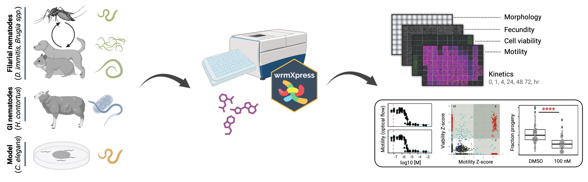

#### Drug screening services

 

    

    

    

        
    

    

    

 

<code>Antiparasitic screening</code> We offer a range of powerful in vitro drug screening assays using phenotyping pipelines and AI-assisted software developed in our laboratory. We offer multidimensional screening assays for vector and soil-transmitted helminths of veterinary, agricultural, and human health relevance, as well as the model nematode *C. elegans*. Our platforms are scalable and provide quantitative multivariate readouts of drug action and kinetics. The deliverables for each assay will include an overview of QC data and processing of image data into informatives plots. All raw data will be retained for a year post delivery.

<code>Drug target assays</code> We offer additional services to help identify druggable targets and guide structure-activity relationship studies, including procurement or creation of transgenic *C. elegans* strains for comparative phenotypic screening, forward genetic screens to identify mutations that alter drug responses, production of tissues for drug target engagement assays, and other customized deliverables. 

<code>Assay pricing</code> Contact us for assay menus and pricing. Pricing will depend on the method of parasite rearing or procurement, the format of drugs or chemicals provided, or other custom modifications of core pipelines.

In vitro assays:
- Filarial parasites: *D. immitis* (mf, L3, and L4), *Brugia spp.* (adult males and females) 
- Gastrointestinal nematodes: *H. contortus* (larval assasys)
- Model nematodes: *C. elegans*

Inquire for additional information on in vivo anthelmintic efficacy and in vitro ectoparasiticide and larvicide testing.

